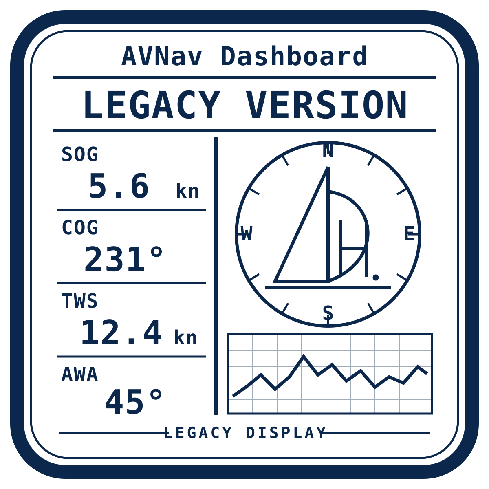

# AVNav Legacy Display

  <picture>
    <source
      media="(prefers-color-scheme: dark)"
      srcset="assets/logos/logo-dark-red.svg">
    
  </picture>

E-Ink-optimierte Dashboards für ältere Browser, Tolino, Kindle und AVNav.

**Aktuelle Version: 0.4.2**

Die Standardanzeigen verwenden **DBK** für die Tiefe unter dem Kiel und
**SOG** für die Geschwindigkeit über Grund.

## Standardwerte

Als nautisch sinnvolle Vorgabe verwendet das Plugin:

| Anzeige | Bedeutung |
|---|---|
| **DBK** | Depth Below Keel – Tiefe unter dem Kiel |
| **SOG** | Speed Over Ground – Geschwindigkeit über Grund |

DBK ersetzt als Standardwert DBT (Depth Below Transducer).  
SOG ersetzt als Standardwert STW (Speed Through Water).

## Änderungen in Version 0.4.2

- Automatischer POST-zu-GET-Fallback beim Speichern der Konfiguration
- Kompatible Server-Speicherung mit alten und neuen AVNav-Versionen
- Keine feste Erkennung der AVNav-Version erforderlich
- Logo auf der Konfigurationsseite
- Kleines Logo unterhalb des Hinweises auf der Startseite
